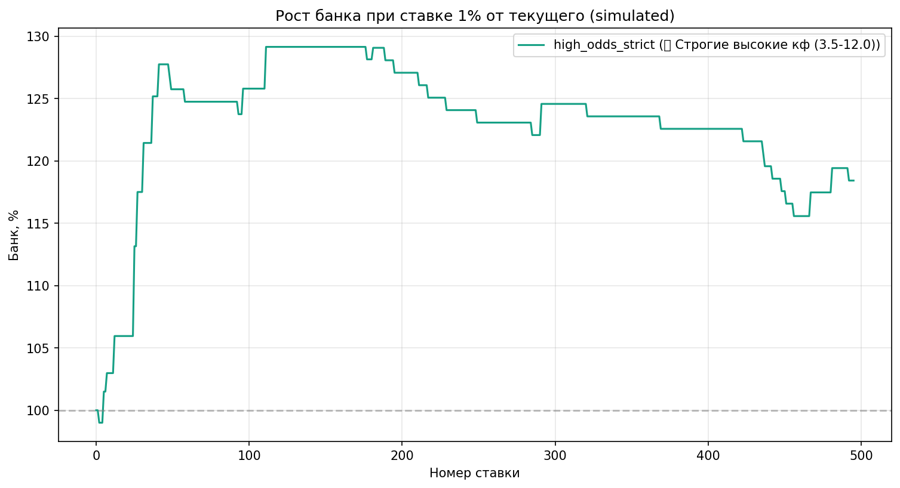

# UFC Winner Prediction & Value Betting Pipeline

> 📌 **Статус:** Демонстрационный прототип для портфолио.  
> Полный проект (историческая БД, обученные веса `.cbm`, логи бэктестов) весит **>1 ГБ** и не включён в репозиторий из-за лимитов GitHub.

## 🎯 Назначение
Открытый архитектурный срез ML-пайплайна для прогнозирования исходов боёв UFC и расчёта математического ожидания (EV) ставок. Код демонстрирует:
- Модульную структуру инженерного пайплайна (`src/` для ядра, `experiments/` для исследований)
- Безопасное управление секретами и конфигурацией (`.env`)
- Воспроизводимую логику feature engineering, обучения CatBoost и фильтрации value-ставок

## 📁 Структура проекта
- `run.py` — точка входа (оркестратор пайплайна)
- `src/` — ядро: подготовка данных, обучение, валидация, фильтрация, бэктест
- `experiments/` — исследовательские скрипты (анализ калибровки, фичей, оптимизация)
- `data/` — заглушка (реальные данные хранятся локально)
- `backtest_result/` — отчёты и графики лучшего прогона
- `.env.example` — шаблон переменных окружения
- `requirements.txt` — зависимости

## ⚙️ Стек
- **Python 3.10+**
- **ML/Data:** `pandas`, `catboost`, `scikit-learn`, `numpy`
- **Инструменты:** `requests`, `beautifulsoup4`, `matplotlib`, `seaborn`, `joblib`, `python-dotenv`

## 🚀 Запуск
### 1. Демонстрационный режим (без данных)
```bash
git clone <repo_url>
cd <repo_name>
pip install -r requirements.txt
python run.py
```
> ✅ Скрипт выполнит валидацию структуры, проверит конфигурацию и выведет статус готовности. Этого достаточно для ревью кода.

### 2. Полный прогон (локально)
1. Положи исторический датасет в `data/UFC_full_data_golden.csv`
2. Создай `.env` из `.env.example`, добавь `ODDS_API_KEY` (при наличии)
3. Запусти `python run.py`

###📊 Метрики 
(бэктест 2024–2025, out-of-sample, N=496 боёв)
Активная стратегия: medium_high_value (кф 2.8–5.0, переходная зона)

| Метрика | Значение |
|---------|----------|
| Прибыль | +18.4% |
| ROI (без комиссии) | +0.50% |
| Макс. просадка | -13.57% |
| Винрейт | 37.8% |
| Количество ставок | 37 |
| Средний EV | +155% |
| LogLoss | рассчитывается при валидации (см. `src/validate_model.py`) |

> ⚠️ **Важно:** Результаты получены на исторических данных. Модель не учитывает реальные лимиты букмекеров, поздние замены бойцов, изменение весовых категорий и проскальзывание. Не является финансовой рекомендацией.



## 📜 Лицензия
MIT. Код предоставляется «как есть» для образовательных и исследовательских целей. Архитектура и логика открыты, точные веса модели и полные датасеты защищены от публичного копирования.
