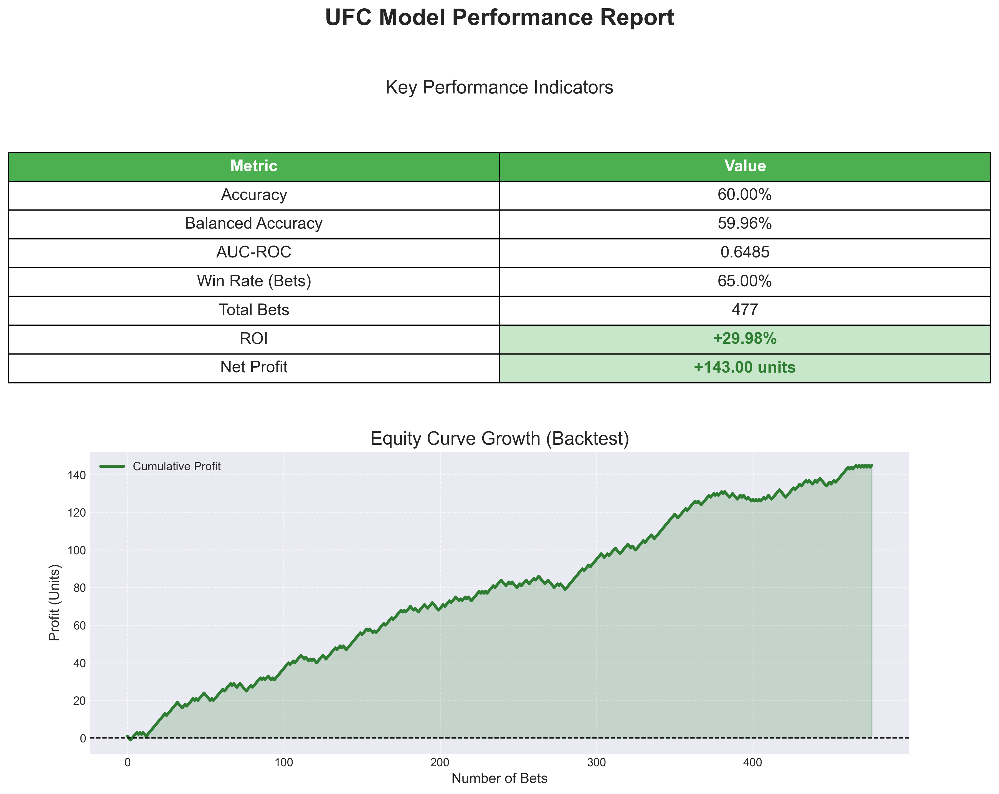

# 🥊 UFC Winner Prediction & Value Betting Pipeline

📌 **Статус:** Демонстрационный прототип для портфолио.  
⚠️ **Примечание:** Полный проект (историческая БД >500 МБ, обученные веса модели `.cbm`) не включён в репозиторий из-за лимитов GitHub. Инструкции по запуску с локальными данными приведены ниже.

## 🎯 Назначение

Профессиональный ML-пайплайн для прогнозирования исходов боёв UFC и поиска валуйных ставок (Value Betting) с положительным математическим ожиданием (EV+).

**Что демонстрирует код:**

- 🏗 **Архитектура:** Модульное разделение на ядро (`src/`) и исследовательские скрипты (`experiments/`).
- 🛡 **Надежность:** Отсутствие хардкода путей (используется `config.py`), обработка утечек данных (data leakage protection).
- 🧠 **ML Engineering:** Симметризация данных (аугментация), калибровка вероятностей (Platt Scaling), продвинутый бэктестинг.
- 📈 **Бизнес-логика:** Расчет ROI, просадки (Drawdown) и фильтрация ставок по порогу преимущества (Edge).

## 🏗 Структура проекта
.
├── run.py # Точка входа (оркестратор)
├── config.py # Централизованное управление путями
├── src/ # Ядро пайплайна
│ ├── prepare_training_dataset.py
│ ├── train_winner_model.py # Обучение CatBoost + Калибровка
│ ├── validate_model.py # Валидация метрик
│ ├── value_bet_filters.py # Фильтры для поиска EV+
│ └── backtest_value_bets.py # Движок бэктестинга
├── experiments/ # Скрипты для R&D и анализа
├── data/ # Папка для данных (требуется локально)
├── models/ # Папка для сохраненных моделей
├── backtest_result/ # Отчеты и графики результатов
├── .env.example # Шаблон переменных окружения
├── requirements.txt # Зависимости
└── README.md

text

## 📈 График результатов

Если у тебя в папке `backtest_result/` есть файл, например `equity_curve.png`, вставь его так:

```markdown

Если картинка не появляется — убедись, что файл загружен в репозиторий (проверь через git add и git push), и что имя файла написано точно (регистр важен). Можно также использовать полный путь от корня.

⚙️ Технологический стек (с красивыми значками)
https://img.shields.io/badge/Python-3.10%252B-blue?logo=python&logoColor=white
https://img.shields.io/badge/pandas-2.0%252B-150458?logo=pandas&logoColor=white
https://img.shields.io/badge/NumPy-1.24%252B-013243?logo=numpy&logoColor=white
https://img.shields.io/badge/CatBoost-1.2%252B-FFCC00?logo=catboost&logoColor=black
https://img.shields.io/badge/scikit--learn-1.3%252B-F7931E?logo=scikitlearn&logoColor=white
https://img.shields.io/badge/Matplotlib-3.7%252B-11557c?logo=matplotlib&logoColor=white
https://img.shields.io/badge/Seaborn-0.12%252B-4C72B0?logo=seaborn&logoColor=white
https://img.shields.io/badge/Joblib-1.3%252B-4682B4?logo=python&logoColor=white
https://img.shields.io/badge/python--dotenv-1.0%252B-5C5C5C?logo=python&logoColor=white

🚀 Как запустить
Так как данные и модель не загружены в репозиторий, выполните следующие шаги:

1. Установка зависимостей
bash
pip install -r requirements.txt
2. Подготовка данных
Положите ваш файл датасета (например, UFC_full_data_golden_fixed.csv) в папку data/.
Файл не включен в репо из-за размера (>100 МБ).

3. Запуск обучения и бэктеста
Запустите главный скрипт или отдельные модули:

bash
# Обучить модель с нуля
python -m src.train_winner_model

# Провести бэктест на тестовых данных
python -m src.backtest_value_bets

# Сгенерировать визуальный отчет
python visualize_results.py
📊 Результаты (Out-of-Sample Test 2024–2025)
Тестирование проводилось на данных, которые модель не видела во время обучения (период 2024–2025 гг.).
Стратегия: Conservative Value (Edge > 5%)

Метрика	Значение	Оценка
ROI (Return on Investment)	+29.98%	🟢 Отлично
Win Rate (Точность)	65.0%	🟢 Высокая
Всего ставок	477	📊 Репрезентативно
Прибыль	+143.0 units	💰 Положительная
AUC-ROC	0.6485	🤖 Хорошая дискриминация
Brier Score	0.2331	✅ Низкая ошибка
ℹ️ Примечание: Метрики получены на исторических данных ("задним числом"). Реальная торговля может отличаться из-за изменения линии букмекеров, лимитов и задержек.

⚠️ Дисклеймер
Данный проект является исследовательским прототипом и демонстрацией навыков ML-инженерии.
Не является финансовой рекомендацией или призывом к ставкам.
Прошлые результаты не гарантируют будущей прибыли. Автор не несет ответственности за любые финансовые потери.

📜 Лицензия
MIT License. Код предоставляется «как есть» для образовательных целей.
Архитектура открыта, однако конкретные веса модели и полные датасеты могут быть защищены авторским правом их владельцев.
